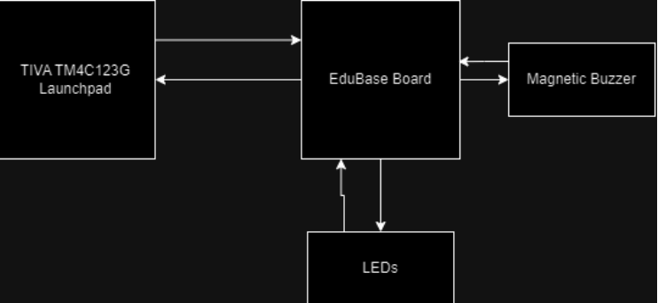
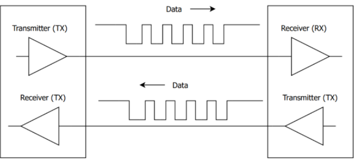

# Introduction

The Secure Watch Observation Response Device (S.W.O.R.D) is an advanced at-home monitoring system designed to enhance home security and provide users with convenient control over essential functions. This system allows users to lock and unlock doors, check door statuses, and arm or disarm the alarm system. With a focus on creating a reliable and responsive user experience, S.W.O.R.D integrates multiple peripherals to deliver both functionality and interactivity.

Key peripherals used in this project include:

* UART (Universal Asynchronous Receiver-Transmitter): Enables seamless communication between the microcontroller and a terminal, allowing users to control the system through a menu-based interface.
* GPIO (General-Purpose Input/Output): Provides control for physical components, such as push buttons for door and alarm interactions, as well as LEDs for status indication.
* Buzzer: Generates auditory alerts to notify users of status changes, such as locking or unlocking doors and arming/disarming the alarm.
* LEDs: Used for visual feedback, indicating system statuses, including armed/disarmed modes and door locks.

This project highlights the integration of these peripherals to create an intuitive security solution, emphasizing UART's role in facilitating real-time feedback and user interaction.

# Background and Methodology
The idea to develop an alarm system for our project stemmed from a combination of practical utility and technical curiosity. Home security systems are an essential part of modern living, offering peace of mind and convenience for users. Designing an alarm system not only allowed us to address this real-world application but also provided an opportunity to explore and deepen our understanding of embedded systems and microcontroller functionality.

S.W.O.R.D utilizes concepts regarding UART, sound generation, and general-purpose input/output.
* UART (Universal Asynchronous Receiver-Transmitter) plays a crucial role in the S.W.O.R.D system by enabling efficient and reliable communication between devices. In a security system like S.W.O.R.D, where real-time feedback and user interaction are essential, UART facilitates seamless data exchange between the microcontroller and the user’s terminal.
* Sound Generation is also integrated for alarm functionality. For instance, if the home is armed and a door is locked or unlocked, an alert sound will play through a buzzer on the microcontroller board, signaling these status changes.
* GPIO (General-Purpose Input/Output) forms the core interface, with push buttons serving as the control points for various actions, such as opening doors, locking doors, and arming/disarming the system.

We successfully achieved our project goals by leveraging UART as the primary communication interface between the microcontroller and a terminal, enabling real-time user interaction through a menu-based system. The integration of peripherals like GPIO, LEDs, and a buzzer enhanced the functionality and usability of the alarm system. GPIO pins allowed us to control the status of virtual doors, represented by LEDs, while the buzzer provided auditory feedback for system events such as locking, unlocking, and arming the alarm. Rigorous testing and iterative debugging ensured that the system was both functional and reliable, meeting our objectives of creating an intuitive, responsive, and practical security solution.

# Block Diagrams

The block diagram provided is the final result. Compared to the previous block diagram provided in the proposal, there are less hardware peripherals due to the main focus switching to UART. The second diagram illustrates the role of UART in the S.W.O.R.D system. The process begins with the user entering their selection on the terminal, which transmits the data to the receiver—the TIVA microcontroller (MCU). Upon receiving the data, the MCU executes the corresponding function and sends a response back to the terminal for user feedback.

# Components Used
* Tiva C Series TM4C123G LaunchPad
* USB-A to Micro-USB Cable 
* EduBase Board
* LEDs
* Buzzers
* UART
* Teraterm

# Pinout
The pinout plan provided incorporates both hardware pins, as well as the key that is configured in UART
| Function        | Peripherals/Pins           | Details  |
| ------------- |:-------------:| -----:|
| Lock/Unlock all Doors    | Configured via UART. User presses either the ‘1’ or ‘2’ key. | Locks or Unlocks all the doors depending on what the user picks.|
| System Arm/Disarm      | Configured via UART. Users can arm/disarm specific doors.      |Transmit a signal to either arm or disarm a door.|
| Alarm Sound (Buzzer) | PC4      |Output pin for sound generation using a buzzer; can be activated when the alarm triggers.|
| Lighting Control (RGB LEDs)    | PF1, PF2, PF3     |   RGB LEDs that display green when the system is disarmed, and red when armed. |
| UART | PA1, PA0    |Set up UART module 0 where PA0 is the transmitter and PA1 is the receiver. |
| EDUBase LED’s     | PB0, PB1, PB2, PB3     | Output pins to display which doors are locked or unlocked.|

# Results
Overall, S.W.O.R.D successfully achieved its primary goal of creating a responsive and functional alarm system. However, one significant challenge arose during the integration of the EduBase buttons with UART functionality. Extensive testing revealed that the EduBase buttons operated as expected when UART was disabled. However, when UART was enabled, the buttons ceased to function, while all other peripherals continued to perform correctly. This discrepancy suggests that a critical detail in the interaction between UART and the button functionality may have been overlooked. As a result, a menu-based system using UART was implemented to test and control the door functions, compensating for the non-functional buttons. Despite this limitation, the system demonstrated reliability in its other features and showcased the potential for further refinement.
The videos below demonstrate the successful demonstration of the project and its features.

[Unlocking and Locking all Doors](https://youtube.com/shorts/gLaMlRsW7HI?feature=share)

[Individual Doors](https://youtube.com/shorts/46efch1l2oM?feature=share)

[Checking Status of Doors](https://youtube.com/shorts/VmJTVrA3VxQ?feature=share)

[Alarm System](https://youtube.com/shorts/E-CSAvw4ODc?feature=share) 